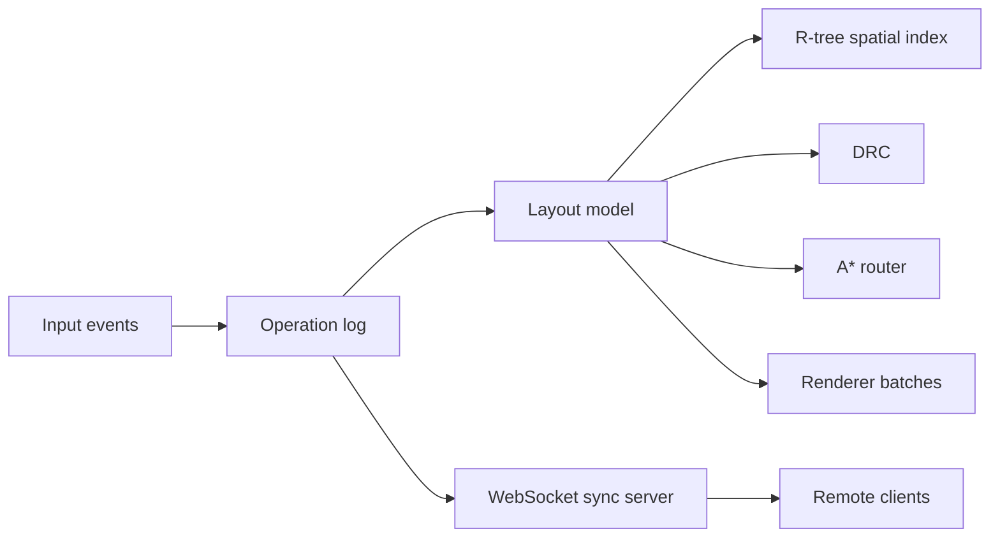

# Fabricad

Fabricad is a Rust/WASM mask-layout editor for simplified semiconductor fabrication geometry. It is scoped as a portfolio-grade technical CAD tool: layered polygon editing, grid snapping, measurement, design-rule checking, obstacle-aware routing, large-layout stress generation, and WebSocket operation sync.

The workspace intentionally mirrors the shader structure from `~/code/game`: Slang source lives in `assets/shaders/slang`, and Cargo drives `scripts/compile_shaders.py` to emit WGSL and SPIR-V under `assets/shaders/compiled_shaders`.

## Workspace

```text
crates/
  geometry_core/  Integer DBU coordinates, rects, polygons, snapping, distance helpers
  layout_model/   Document/layer/shape schema, operation log, R-tree spatial index
  drc/            Simplified semiconductor rule deck and violation reporting
  router/         A* maze router over layout obstacles
  renderer/       GPU vertex batching, 3D viewport targets, and Slang WGSL/SPIR-V build hook
  native_app/     egui/wgpu desktop editor
  sync_server/    Axum WebSocket collaboration server
  wasm_app/       wasm-bindgen/eframe web entry point
```



## Run

```bash
cargo run -p native_app --bin fabricad
```

```bash
cargo run -p sync_server --bin fabricad-sync
```

The editor saves and loads a JSON layout at `examples/fabricad_layout.json`.
It also exports and imports a GDSII subset at `examples/fabricad_layout.gds`.
For collaboration, start `fabricad-sync`, open multiple native or browser clients, and click `Connect` in each editor. Browser clients default to `ws://<page-host>:4141/ws`; override with `?sync=ws://127.0.0.1:4141/ws` when needed.

## Shader Pipeline

```bash
python3 scripts/compile_shaders.py all
```

The script discovers `*.slang` files under `assets/shaders/slang` and writes:

```text
assets/shaders/compiled_shaders/wgsl/*.wgsl
assets/shaders/compiled_shaders/spirv/*.spv
assets/shaders/compiled_shaders/reflection/*.json
```

Cargo also runs this through `crates/renderer/build.rs`. Set `FABRICAD_SLANGC=/path/to/slangc` if `slangc` is not on `PATH`; set `FABRICAD_SKIP_SHADER_COMPILE=1` to skip the build hook.

## Rendering Architecture

The 2D layout canvas uses egui-wgpu paint callbacks to draw batched layout triangles
directly into the egui render pass, with a separate GPU picking pass. The 3D layout view
now has a dedicated wgpu viewport render target: native_app builds opaque 3D layout
geometry, renderer uploads it into a 3D pipeline, renders it into an offscreen color
texture with a depth attachment and depth write/test enabled, then composites that texture
back into the egui canvas. HUD text, edit handles, and other UI overlays stay in egui and
are drawn after the 3D viewport composite.

If a client starts without an egui wgpu render state, the 3D view falls back to the older
egui painter projection path. That fallback is isolated in native_app and should not grow
new painter-sort behavior.

## Technology Files

Built-in process definitions live in `assets/technology/`. The default demo technology is loaded at startup and drives:

```text
layers + colors + purposes + display order
manufacturing grid
connectivity stack
min width / spacing / enclosure / forbidden-overlap DRC rules
```

The native app exposes a technology picker in the side panel. Switching technology reapplies layer definitions and rebuilds the active DRC rule deck.

## GDSII Import And Export

The shared layout model includes a minimal binary GDSII reader/writer for interoperability tests and KLayout inspection:

```text
Fabricad cells     -> GDS structures
Cell instances     -> SREF / AREF records
Rectangles/polys   -> BOUNDARY records
Paths              -> PATH records
Labels             -> TEXT records
Technology mapping -> GDS layer/datatype/texttype
```

Imported AREF arrays become first-class Fabricad instance arrays. Measurement annotations export as a path plus text label because GDSII has no native measurement object.

## Current Demo

- Pan and zoom an infinite mask canvas.
- Read a bottom-left nm/um scale bar while zooming.
- Toggle named fabrication layers.
- Switch JSON technology files for layers, grid, connectivity, and DRC thresholds.
- Draw rectangles, polygons, paths, vias, and measurements.
- Select and drag shapes with grid snapping.
- Drag selected rectangle, polygon, and path vertices with visible handles.
- Double-click selected edges to insert vertices, hover vertices and press Delete to remove them, and drag rectilinear polygon edges.
- Copy, paste, duplicate, delete, rotate 90 degrees, and mirror selected top-level shapes.
- Edit selected shape layer, name, net, coordinates, path width, label text, and measurement endpoints in the side panel.
- Create a cell from selected top-level shapes, place cell instances, and drag instance occurrences.
- Rename cells and selected instances with commit-on-Enter/focus-loss editing.
- Edit selected instance translation, rotate/mirror transforms, and array rows/columns/pitch from the side panel.
- Undo and redo local edits.
- Run simplified DRC for min width, spacing, enclosure, forbidden overlap, and off-grid vertices.
- Browse DRC markers, click a marker to focus and select its shapes, and persist marker hide/waive state through JSON save/load.
- Extract connected nets across metal/contact/via stacks from the active technology file.
- Select a connected shape to highlight its inferred net and inspect labels, opens, and shorts.
- Place two route points to create an A* metal route around obstacles.
- Route output inherits the endpoint net ID or label when the selected endpoints imply one.
- Generate 10k, 100k, or 1M rectangle stress layouts.
- Generate a hierarchy demo with repeated cell instances.
- Export and import the current layout through the GDSII subset.
- Sync edits, cursors, and selections between native and WebAssembly clients.
- See live FPS-adjacent frame timing, visible shape count, spatial query time, pick-build time, DRC time, route time, and batch memory estimate.
- Track resident GPU geometry buffers, per-frame upload bytes, and upload/skip counts in the performance panel.
- Track resident and evicted tiles, tile-cache memory budget, over-budget bytes, shape-batch cache hits/misses, indirect draw ranges, and pick candidates.

## Verification

The step-by-step implementation plan lives in [`docs/ROADMAP.md`](docs/ROADMAP.md).

```bash
cargo check --workspace
cargo test --workspace
cargo run -p native_app --bin fabricad -- --offscreen
```

The offscreen native mode renders through the same wgpu layout pipeline, reads
back pixels, prints a one-line render summary, and exits without opening a
window. You can also enable it with `FABRICAD_OFFSCREEN=1`.

Screenshot-based render E2E checks run the web build under Chrome, capture deterministic
demo, selected-handle, hierarchy, stress-layout, and 3D-view screenshots, and assert targeted
visual invariants such as nonblank canvas coverage and expected layer colors:

```bash
./scripts/render_e2e.py
```

Artifacts are written to `target/render-e2e/`. Broad whole-UI pixel baselines are quarantined
because the UI is still moving; compare them explicitly only when investigating visual drift:

```bash
./scripts/render_e2e.py --check-baseline
```

When an intentional rendering change updates the quarantined expected output, regenerate baselines with:

```bash
./scripts/render_e2e.py --update-baselines
```

Whole-app layout audits capture every Fabricad module across a fixed viewport matrix and
write raw screenshots plus contact sheets for manual review of clipped labels, crowded
margins, awkward wrapping, and misplaced scrollbars:

```bash
./scripts/ui_layout_audit.py
```

Artifacts are written to `target/ui-layout-audit/`; open
`target/ui-layout-audit/index.html` or the PNGs under `contact-sheets/`. For a faster
smoke pass while iterating on chrome/layout changes, run:

```bash
./scripts/ui_layout_audit.py --quick
```

## Web Build

The `wasm_app` crate is wired for Trunk:

```bash
rustup target add wasm32-unknown-unknown
env -u NO_COLOR trunk serve
```

The native editor is currently the primary demo path. The WebAssembly target shares the same core crates and eframe UI entry point.

## Collaboration Protocol

The sync server keeps an authoritative `Document`, assigns monotonically increasing sequence numbers for legacy commands, applies incoming Loro updates, and broadcasts ordered updates plus cursor and selection presence.
Native and WebAssembly clients share the same collaboration handler.

Loro is used for replicated update exchange and object-map recovery:

- semantic editor commands are wrapped in CRDT operation envelopes with stable actor/counter IDs;
- Loro carries the operation stream between clients and server;
- shape, cell, and instance object maps mirror the latest registers plus tombstones;
- reconnect and server startup recover from persisted Loro snapshots, then materialize object maps back into the layout document.

The sync server persists state to `target/fabricad-sync/state.json` by default. Set `FABRICAD_SYNC_STATE=/path/to/state.json` to choose a file, or `FABRICAD_SYNC_STATE=off` to keep it in memory only.

Conflict behavior in this MVP is deterministic and simple:

- Server order wins.
- Delete wins over later moves because moves against missing shapes are ignored by the model.
- Delete wins over later vertex replacements because replacements against missing shapes are ignored.
- Duplicate CRDT operation IDs are ignored.
- Concurrent layer changes converge according to the server's accepted order.
- Remote shape IDs advance the receiver's allocator so later local inserts do not collide.
- Clients can request a full snapshot to recover from missed messages.

This is still semantic-command based rather than geometry-specific CRDT merging. The next collaboration layer should add per-object merge policies for richer shape editing.
