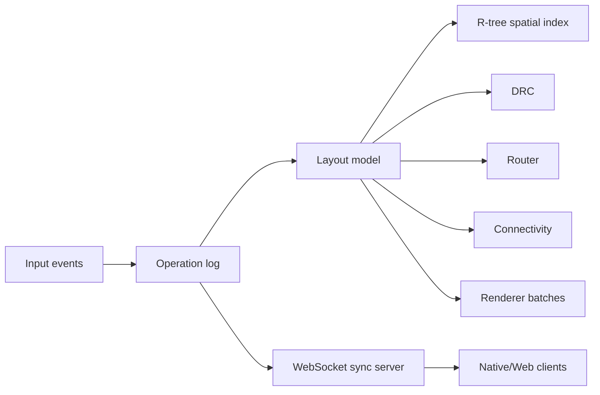

# Glassworks

Glassworks is the current working name for a Rust native/WebAssembly semiconductor layout workbench. The project is closer to a small EDA/layout environment than a general drawing or modeling app: it focuses on mask-layout geometry, hierarchy, process technology data, DRC, routing, connectivity extraction, import/export, rendering, and collaboration.

This is not an industrial signoff tool. The point is to build a credible, inspectable implementation of the core workflows around semiconductor physical layout.

## What It Does

- Edits 2D mask-layout geometry with layers, snapping, measurements, selections, vertex editing, shape transforms, hierarchy, cells, instances, arrays, and a small reusable via-array macro flow.
- Loads built-in technology files for layer definitions, purposes, display order, grid, connectivity, GDS mapping, and DRC rule data.
- Runs DRC explicitly across the full layout, the active layout cell, or a selected region. DRC uses the document/hierarchy rather than the current view filter.
- Runs routing explicitly from placed route points. Routing treats same-net or same-component geometry as route context instead of generic obstacles.
- Extracts connected nets across the active technology stack, reports opens/shorts, recognizes a few simple devices, exports SPICE-style netlists, and compares supported devices/nets against a SPICE `.subckt`.
- Imports and exports workspace/layout/session JSON plus GDSII, CIF, DXF, DEF, LEF, DRC reports/decks, reference-image metadata, extracted netlists, trace state, and L2N database JSON.
- Renders native UI and layout previews through an Operad retained UI document and winit/wgpu, with snapshot/audit/offscreen paths for deterministic checks.
- Syncs edits, cursors, and selections through a Rust WebSocket server with Loro-backed update exchange.

Display filters are intentionally separated from analysis scope. Layer visibility, hierarchy display depth, and view-only hidden cells affect the 2D view and picking, while DRC, routing, connectivity, and 3D layout bounds operate on the underlying physical document/hierarchy.

## Workspace

```text
crates/
  geometry_core/  Integer DBU coordinates, rects, polygons, snapping, distance helpers
  layout_model/   Document schema, technology files, hierarchy, formats, connectivity
  drc/            Data-driven DRC rules, derived layers, marker/report state
  router/         A* maze router over layout obstacles and route context
  renderer/       GPU batching, tile/cache logic, 3D viewport targets, shader build hook
  native_app/     Native window, retained UI shell, snapshots, audits, app behavior
  sync_server/    Axum WebSocket collaboration server
  wasm_app/       wasm-bindgen web validation entry point
```



## Run

Run the native app:

```bash
cargo run
```

The workspace defaults to the native app, and `native_app` defaults to the `glassworks` binary.

Run the sync server:

```bash
cargo run -p sync_server --bin glassworks-sync
```

For collaboration, start `glassworks-sync`, open multiple native or browser clients, and click `Connect` in each editor. Browser clients default to `ws://<page-host>:4141/ws`; override with `?sync=ws://127.0.0.1:4141/ws` when needed.

## Native Utility Modes

The native binary can build the UI document without opening the normal window:

```bash
cargo run -- --audit
cargo run -- --snapshot
cargo run -- --offscreen
```

Snapshot and audit runs accept `--ui-scale <factor>` for HiDPI layout checks. Offscreen mode renders through the same wgpu layout pipeline, reads back pixels, prints a one-line render summary, and exits. It can also be enabled with `GLASSWORKS_OFFSCREEN=1`.

## Web Build

The `wasm_app` crate is wired for Trunk:

```bash
rustup target add wasm32-unknown-unknown
env -u NO_COLOR trunk serve
```

The native window is the primary demo path. The WebAssembly target shares the core crates and exposes validation through wasm-bindgen.

## Files And Exchange Paths

The native app uses deterministic target paths for its built-in File-menu exchange actions:

```text
target/glassworks-session.json
target/glassworks-workspace.json
target/glassworks-layout.json
target/glassworks-layout.gds
target/glassworks-layout.cif
target/glassworks-layout.dxf
target/glassworks-layout.def
target/glassworks-layout.lef
target/glassworks-drc-deck.json
target/glassworks-drc-report.json
target/glassworks-drc-reports.json
target/glassworks-reference-images.json
```

Native file operations also track recent session, workspace, layout, GDS, CIF, DXF, DEF, LEF, reference-image, DRC deck/report/database, Calibre/RVE marker, and L2N database paths in app options.

## Technology Files

Built-in process definitions live in `assets/technology/`. They drive:

```text
layers + colors + purposes + display order
manufacturing grid and DBU scale
connectivity stack
GDS layer/datatype/texttype mapping
min/max width, min/max area, spacing, edge-spacing, enclosure, forbidden-overlap DRC rules
```

Switching technology reapplies layer definitions, rebuilds the built-in DRC deck, and changes connectivity extraction behavior while preserving imported/custom extra layers.

## Layout Formats

The shared `layout_model` crate includes lightweight import/export support for:

- GDSII structures, references, AREF arrays, boundaries, paths, labels, BOX records, layer mapping, and selected properties.
- Flat CIF boxes, polygons, paths, labels, and layers.
- Flat ASCII DXF lines, polylines, polygons, text, and approximated circles/arcs.
- Flat DEF fills, routed special nets/nets, pins, and layers.
- Flat LEF macro `OBS` geometry, obstruction paths, pin ports, and layers.

These are practical interoperability subsets, not complete format implementations. See [`docs/klayout_2d_feature_gaps.md`](docs/klayout_2d_feature_gaps.md) for the remaining KLayout-grade gaps.

## Shader Pipeline

Slang source lives in `assets/shaders/slang`. Compile all shader outputs with:

```bash
python3 scripts/compile_shaders.py all
```

The script writes:

```text
assets/shaders/compiled_shaders/wgsl/*.wgsl
assets/shaders/compiled_shaders/spirv/*.spv
assets/shaders/compiled_shaders/reflection/*.json
```

Cargo also runs this through `crates/renderer/build.rs`. Set `GLASSWORKS_SLANGC=/path/to/slangc` if `slangc` is not on `PATH`; set `GLASSWORKS_SKIP_SHADER_COMPILE=1` to skip the build hook.

## Verification

Prefer focused checks for the crate or behavior you changed. Use broad workspace or screenshot sweeps when the change is cross-cutting or visual by nature.

Common focused checks:

```bash
cargo test -p layout_model
cargo test -p drc
cargo test -p router
cargo test -p renderer
cargo test -p native_app <test_name> --lib -- --test-threads=1
cargo check -p wasm_app --target wasm32-unknown-unknown
```

Render and UI snapshot tools are available when a rendering or layout change specifically needs visual evidence:

```bash
./scripts/render_e2e.py
./scripts/ui_layout_audit.py --quick
```

Artifacts are written under `target/render-e2e/` and `target/ui-layout-audit/`.

## Collaboration State

The sync server keeps an authoritative `Document`, assigns ordered sequence numbers for legacy commands, applies incoming Loro updates, and broadcasts ordered updates plus cursor/selection presence.

State persists to `target/glassworks-sync/state.json` by default. Set `GLASSWORKS_SYNC_STATE=/path/to/state.json` to choose a file, or `GLASSWORKS_SYNC_STATE=off` to keep it in memory only.

Conflict behavior is intentionally simple for now:

- Server order wins.
- Deletes win over later moves or vertex replacements because operations against missing objects are ignored.
- Duplicate CRDT operation IDs are ignored.
- Remote shape IDs advance the receiver allocator so later local inserts do not collide.
- Clients can request a full snapshot to recover from missed messages.

## Project Notes

- Roadmap: [`docs/ROADMAP.md`](docs/ROADMAP.md)
- KLayout 2D feature gaps: [`docs/klayout_2d_feature_gaps.md`](docs/klayout_2d_feature_gaps.md)
- Collaboration notes: [`docs/COLLABORATION.md`](docs/COLLABORATION.md)
